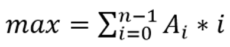

# Describe:  

Cho mảng A[] gồm N phần tử.Nhiệm vụ của bạn là tìm        


 bằng cách sắp đặt lại các phần tử trong mảng. Chú ý, kết quả của bài toán có thể rất lớn vì vậy bạn hãy đưa ra kết quả lấy modulo với 10^9+7.
Input:
    • Dòng đầu tiên đưa vào số lượng bộ test T.
    • Những dòng kế tiếp đưa vào các bộ test. Mỗi bộ test gồm 2 dòng: dòng thứ nhất đưa vào số phần tử của mảng N; dòng tiếp theo đưa vào N số A[i] tương ứng với các phần tử của mảng A[]; các số được viết cách nhau một vài khoảng trống.
    • T, N, A[i] thỏa mãn ràng buộc: 1≤T≤100;  1≤N, A[i] ≤107.
Output:
    • Đưa ra kết quả mỗi test theo từng dòng.
Ví dụ:

```text
Input

2
5
5 3 2 4 1
3
1 2 3
```

```text
Output

40
8
```

```C++
#include <bits/stdc++.h>
using namespace std;
using ll = long long;
const ll mod = 1e9 + 7;
int main(){
    int t; cin >> t;
    while(t--){
        int n; cin >> n;
        vector<int> v;
        for(int i = 0; i < n; i++){
            int x; cin >> x;
            v.push_back(x);
        }
        sort(v.begin(), v.end());
        ll kq = 0;
        for(int i = 0; i < n; i++){
            kq += v[i] * i;
            kq %= mod;
        }
        cout << kq << endl;
    }   
}
```